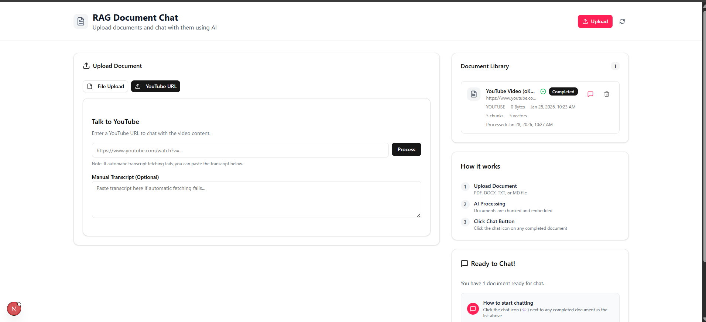
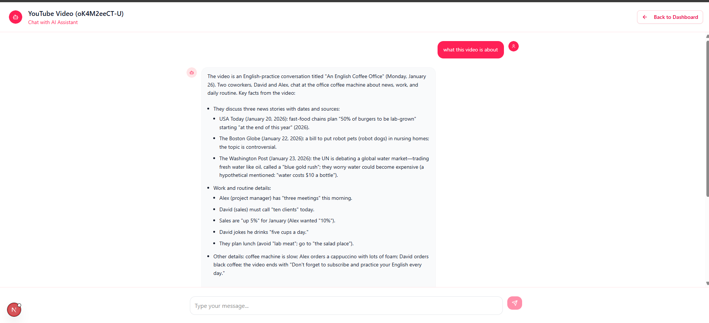
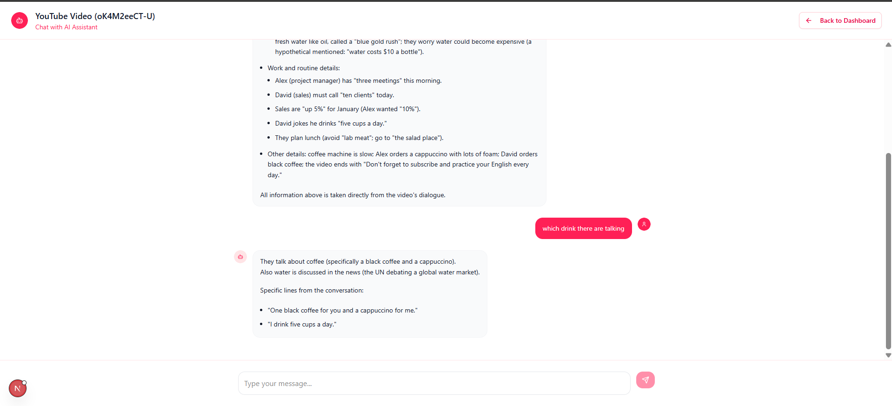

# RAG Document Chat and YouTube Transcription

A modern RAG (Retrieval-Augmented Generation) system that allows you to upload documents, youtube videos and chat with them using AI.

# Exercise 7

## Features

- 📄 **Document Upload**: Support for PDF, DOCX, TXT, and MD files
- 📺 **YouTube Transcription**: Robust extraction of transcripts from YouTube videos
- 🎙️ **Whisper AI Fallback**: Automatic audio download and transcription for videos without captions
- 🤖 **AI Chat**: Chat with your documents and videos using GPT-4
- 🔍 **Semantic Search**: Find relevant content using vector embeddings
- 💾 **Persistent Storage**: MongoDB for documents, Pinecone for vectors
- 🎨 **Modern UI**: Clean ChatGPT-style interface
