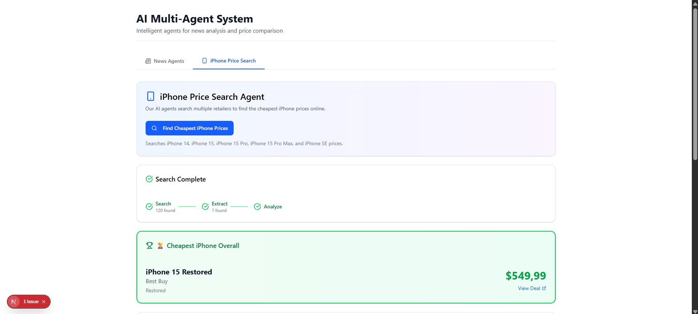
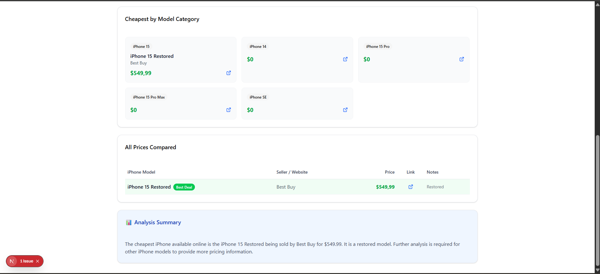

# iPhone Price Search & Analysis Agents

A robust multi-agent workflow orchestrated by Inngest to search for real-time iPhone prices, extract structured data, and analyze deals to find the best offers across the web.

## Exercise 9




## Features

- **🔎 iPhone Scout Agent**: Autonomous web searching for the latest iPhone pricing from major retailers.
- **📝 Price Extractor Agent**: Intelligent parsing of raw search results to extract structured data (Model, Price, Storage, Condition, Seller).
- **📊 Price Analyzer Agent**: Comparative analysis to identify:
  - Cheapest overall option
  - Best deals by model (iPhone 15, 14, SE, etc.)
- **🧠 Supervisor Orchestrator**: Manages state, routing, and error recovery between agents.

## How It Works

This project uses the **Inngest Agent Kit** to define a durable, multi-step workflow:

1.  **Search**: The Supervisor routes to the Scout to find raw data.
2.  **Extract**: Raw HTML/text is passed to the Extractor to normalize into JSON.
3.  **Analyze**: Structured data is analyzed to generate a final report of the best deals.
4.  **Durability**: All steps are persisted in MongoDB and Inngest history, allowing the workflow to pause, retry, and resume without losing state.

## Tech Stack

- **Framework**: Next.js 16 (React)
- **Orchestration**: Inngest Agent Kit
- **AI Models**: OpenAI GPT-4o / GPT-3.5-turbo
- **Database**: MongoDB (State & Results persistence)
- **Search API**: Serper.dev
- **Styling**: TailwindCSS

## Getting Started

1.  **Install dependencies:**

    ```bash
    npm install
    ```

2.  **Set up environment variables:**
    Create a `.env` file with the following:

    ```bash
    OPENAI_API_KEY=your_key_here
    MONGODB_URI=your_mongodb_uri
    SERPER_API_KEY=your_serper_key
    INNGEST_SIGNING_KEY=your_inngest_key
    INNGEST_EVENT_KEY=your_inngest_event_key
    ```

3.  **Run the development server:**

    ```bash
    npm run dev
    ```

4.  **Start the Inngest Dev Server:**

    ```bash
    npx inngest-cli@latest dev
    ```

5.  **Trigger the Workflow:**
    Open the Inngest dashboard (usually `http://localhost:8288`) and define a test event or use the application UI to start the `iphone_price_search` workflow.

## Project Structure

- `lib/iphoneAgents.ts`: Definitions for Scout, Extractor, and Analyzer agents (prompts, models).
- `lib/iphoneNetwork.ts`: Network configuration, state management, and orchestration logic.
- `lib/tools/iphonePriceSearch.ts`: Custom tools for searching, extracting, and analyzing.
- `app/inngest/functions.ts`: Inngest function entry points.
